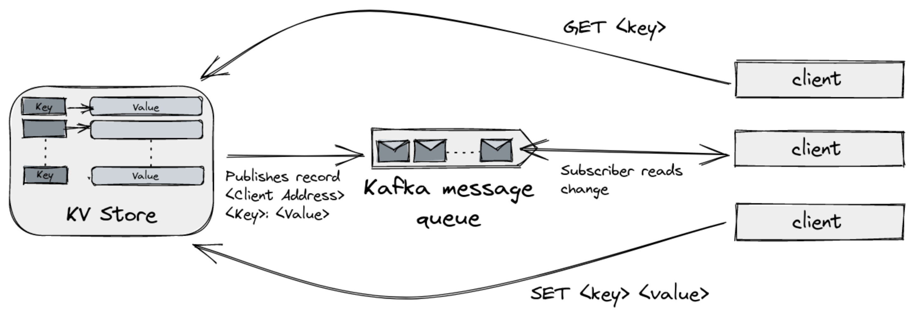

# kv-store

Simple KV (key-value) store web service with a subscription feature to pull changes happening to any of the keys. Also has a CLI client which supports the elementary operations (get, set) along with watch operation to watch changes.

## Overview

This project can be divided into three major steps:
- Build the key-value store server and write endpoints for GET and SET operations.
- Setup a real-time connection with client to send live changes.
- Build a CLI client that consumes the web service and facilitates the required operations.

## Architecture



### The core key-value store

At its core, the KV store is just a `map[interface{}]interface{}` that is being maintained by the server. There are various handlers that allow the user to interact with this `map` object. The web server was implemented using [gorilla/mux](https://github.com/gorilla/mux) and [gorilla/handlers](https://github.com/gorilla/handlers).

- #### `/get` (or `/getall`)

The handler for this endpoint reads in the JSON object in the incoming POST request and then returns another JSON object containing the received key and its value in the KV store. Code can be found in `web/handlers/GetValue.go`.

- #### `/set`

The handler for this endpoint reads in the JSON object containing the key and the value and writes it to the KV store. It also updates the message queue to notify the subscribers of this change. Code can be found in `web/handlers/SetValue.go`

- #### `/subscribe`

The handler for this endpoint opens up a WebSocket connection where it writes every record that is being written to the message queue. The subscriber reads this record and outputs it to the user. The WebSocket was implemented using [gorilla/websocket](https://github.com/gorilla/websocket).

### Communicating changes to subscribers

A regular WebSocket connection can manage this requirement but in a case where there are multiple instances of the KV storage server and multiple clients connected to them, using pub-sub message queues is ideal. Hence, the server publishes every SET request it receives to a Kafka queue. The subscribers then read from a WebSocket connection where the server writes each record.

The client library I used for interacting with Kafka is [segmentio/kafka-go](https://github.com/segmentio/kafka-go). There are a few reasons to go with this over the other alternatives which can be read here: https://github.com/segmentio/kafka-go#motivations.

The whole Kafka deployment is done using `docker-compose`. It runs the `zookeeper` image and the `kafka` image with the necessary configuration defined using environment variables.

The code in `pkg/kafka/kafka.go` has the functions that the server uses to read or write to the queue. The Kafka config is simplistic i.e. one broker, one topic, and one partition.

### The CLI client

Going with [spf13/cobra](https://github.com/spf13/cobra) is an easy choice when building a CLI application. I could easily add stuff like persistent flags and such with the help of it.

For the GET and SET operations, the CLI just sends the appropriate HTTP requests and for the watch operation, it opens a WebSocket connection and keeps it alive until either the user terminates it or the server is unresponsive.

The code can be found in `/kvs-cli`.

## Running

The requirement to run the storage server is Docker. It can be run as follows,
```sh
# Bring up the Kafka containers
docker compose up -d

# Run the server
# --network="host" allows the container to access host's network
# this means that it can connect to Kafka easily as compared to
# setting up a bridge network inside Docker
docker run -it --rm --network="host" prayagsavsani/kv-store:latest
```

Once the server is up and running, we can make requests using `curl`,
```sh
# SET operation
curl 0.0.0.0:23333/set -d '{"Key": "City", "Value": "Ahmedabad"}'

# GET operation
curl 0.0.0.0:23333/get -d '{"Key": "Name"}'

# GET all key-value pairs
curl 0.0.0.0:23333/getall
```

To install the CLI client,
```sh
go install github.com/PrayagS/kv-store/kvs-cli@latest
```

Once installed, use the CLI as follows,
```sh
# GET all keys
kvs-cli --server-address 0.0.0.0:23333 get --all

# GET a given key-value pair
kvs-cli --server-address 0.0.0.0:23333 get --key "Name"

# SET a given key-value pair
kvs-cli --server-address 0.0.0.0:23333 set --key "City" --value "Bangalore"

# Watch changes
kvs-cli --server-address 0.0.0.0:23333 watch
```

## Building

The server can be built as follows,
```sh
git clone https://github.com/PrayagS/kv-store
cd kv-store
go mod download
go build -o main ./cmd/main.go
```

The CLI client can be built as follows,
```sh
git clone https://github.com/PrayagS/kv-store
cd kv-store/cli
go mod download
go build -o kvs ./kvs.go
```

## References

- https://github.com/segmentio/kafka-go/tree/main/examples
- https://github.com/gorilla/websocket/tree/master/examples
- https://github.com/wurstmeister/kafka-docker
- https://github.com/conduktor/kafka-stack-docker-compose
- https://cobra.dev/
